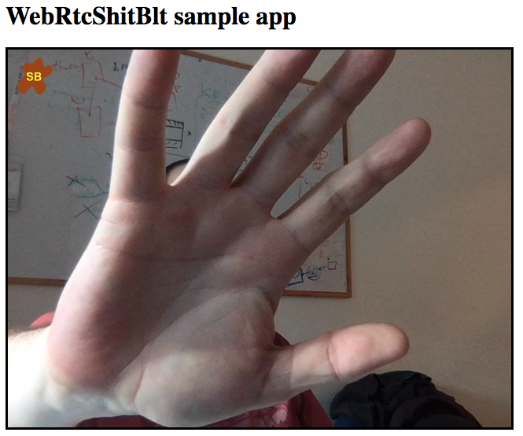

# WebRtcShitBlt

[](https://www.npmjs.com/package/webrtcshitblt)
#### Live demo at https://asafrob.github.io/WebRtcShitBlt/
#### An advanced version is here https://freddy-daniel.github.io/WebRtcShitBlt/
image show a sample use of a video captured by WebRTC with an embeded image (brown/yellow) on the top left corner<br/>


video captured by WebRTC with text embedded on the top left corner<br/>
")

video captured by WebRTC with HTML embedded<br/>
")

### what does it do ?
This library wraps a WebRTC source and returns a MediaStream that can be used as a normal MediaStream u get from navigator.mediaDevices.getUserMedia.<br/>
The returned MediaStream will have your selected image embeded in the video stream.

### common usecases
* logo
* watermark
* image extracted from a presentation
* text watermark
* HTML watermark

### how does it work
The code creates an hidden video element and an hidden canvas element<br/>
The original MediaStream is played on the hidden video element.<br/>
The video element is sampled for images, which are drawn to the hidden canvas.<br/>
The logo image is also being drawn to the canvas.<br/>
Canvas MediaStream is returned to the calling app.

### Sample code
#### example1
```javascript
        // the constanint object defaults to {video: true, audio: false} but to save u the echo...
        let sb = new WebRtcSB({video:{width:640, height:480}, audio: false});
        // create manipulation objects. they will be processed in the order you supply them.
        let imgCopy = new ImageCopy();

        // stamp an image
        let imgAdd = new ImageAdd('sb.png', 10, 10, 50, 50);

        // stamp a text
        let textAdd = new TextAdd('Freddy Daniel', 15, 35, {color: 'yellow', size: '30px'});
        
        // possible construct params for TextAdd
        //      textValue = '',
        //      textPosX = 10,
        //      textPosY = 10,
        //      textOptions = {
        //         fontType:  null,
        //         color: 'yellow',
        //         size: '20px',
        //         bold: false,
        //         italic: false,
        //         outline: true, 
        //         outlineWidth: 3,
        //         outlineColor: 'green'
        //     }

        sb.setManipulators([imgCopy, imgAdd, textAdd]);

        sb.sbStartCapture()
            .then((stream)=> {
            document.getElementById('myVideo').srcObject = stream;
        })
```
#### example 2
```javascript
        // the constanint object defaults to {video: true, audio: false} but to save u the echo...
        let sb = new WebRtcSB({video:{width:640, height:480}, audio: false});
        // create manipulation objects. they will be processed in the order you supply them.
        let imgCopy = new ImageCopy();

        // stamp a text
        let htmlAdd = new HTMLAdd(); // dependency html2canvas.js required to use this manipulator
        htmlAdd.setLabel('Freddy', {
            /* css overrides */
            padding: '5px',
            borderRadius: '5px'
        });

        sb.setManipulators([imgCopy, htmlAdd]);

        sb.sbStartCapture()
            .then((stream)=> {
            document.getElementById('myVideo').srcObject = stream;
        })
```

### Note
* this library is based on ES6
* Require dependency html2canvas.js if using HTMLAdd manipulator
